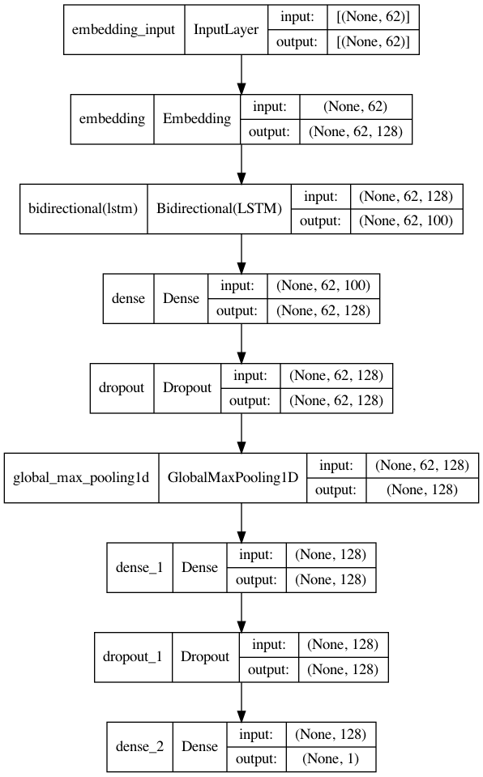

# A Neural Network Classifier with Bidirectional LSTM

This project uses Neural Network classifier with Bidirectional LSTM for OnionOrNot fake news detection. We use [Kaggle dataset](https://raw.githubusercontent.com/lukefeilberg/onion/master/OnionOrNot.csv) and [Keras deep learning library](https://keras.io/) in Python.

- [A Brief Introduction to Bi-LSTM](#a-brief-introduction-to-bi-lstm)
- [The Model](#the-model)
- [Train LSTM](#train-lstm)
- [Evaluate LSTM](#evaluate-lstm)

## A Brief Introduction to Bi-LSTM
LSTM networks are able to maintain their state information in some specially designed memory cells or gates. The networks carry out an aggregation operation on the historical state stored in the forget gates with the current state information to compute the future state information. The information available at the current time slot is received at the input gates. Using the results of aggregation at the forget gates and the input gates, the networks predict the next value of the target variable. The predicted value is available at the output gates.

Bidirectional LSTMs are an extension of traditional LSTMs that can improve model performance on sequence classification problems. In problems where all timesteps of the input sequence are available, Bidirectional LSTMs train two instead of one LSTMs on the input sequence. The first on the input sequence as-is and the second on a reversed copy of the input sequence. This can provide additional context to the network and result in faster and even fuller learning on the problem.

## The Model
The first layer is the **Word Embedding layer**. Word embeddings provide a dense representation of words and their relative meanings. Keras offers an Embedding layer that can be used for neural networks on text data. The Embedding layer is initialized with random weights and will learn an embedding for all of the words in the training dataset.

The second layer is the **Bidirectional LSTMs layer**. Bidirectional LSTMs are supported in Keras via the [Bidirectional layer wrapper](https://keras.io/api/layers/recurrent_layers/bidirectional/). This wrapper takes a LSTM layer as the parameter and the default `concat` mode to concatenate the forward and backward outputs, providing double the number of outputs to the next layer. This LSTM layer will have 50 memory units, applies a dropout rate of 10 percent and yields a shape of (62, 100) at its output. This implies that 100 features are extracted by each node of the LSTM layer from every record in the input data. 

A dense layer with 128 nodes receives the output from the Bidirectional LSTM layer. A dropout layer is used after the first dense layer that randomly switches off the output of 50 percent of the nodes to avoid model overfitting. A max pooling layer receives the output from the dropout layer and then forwards the input to another dense layer with 128 node. A dropout layer then randomly switches off 50 percent of the output and feeds the output to the final output layer. A single node at the output of the final dense layer yields the predicted value. Except for the output layer, the activation
function rectified linear unit (ReLU) is used. At the output layer, the sigmoid activation function is used.

Finally, because this is a binary classification problem, the binary log loss (binary_crossentropy in Keras) is used. The efficient ADAM optimization algorithm is used to find the weights and the accuracy metric is calculated and reported each epoch.

```python
model = Sequential()

model.add(Embedding(10000, 128, input_length=X.shape[1]))
model.add(Bidirectional(LSTM(50, return_sequences=True, recurrent_dropout=0.1)))
model.add(Dense(128, activation='relu'))
model.add(Dropout(0.5))
model.add(GlobalMaxPool1D())
model.add(Dense(128, activation='relu'))
model.add(Dropout(0.5))
model.add(Dense(1, activation='sigmoid'))
model.compile(loss='binary_crossentropy', optimizer='adam',
              metrics=['accuracy'])

model.summary()

```
Output:
```
Model: "sequential"
_________________________________________________________________
 Layer (type)                Output Shape              Param #   
=================================================================
 embedding (Embedding)       (None, 63, 128)           1280000   
                                                                 
 bidirectional (Bidirectiona  (None, 63, 100)          71600     
 l)                                                              
                                                                 
 dense (Dense)               (None, 63, 128)           12928     
                                                                 
 dropout (Dropout)           (None, 63, 128)           0         
                                                                 
 global_max_pooling1d (Globa  (None, 128)              0         
 lMaxPooling1D)                                                  
                                                                 
 dense_1 (Dense)             (None, 128)               16512     
                                                                 
 dropout_1 (Dropout)         (None, 128)               0         
                                                                 
 dense_2 (Dense)             (None, 1)                 129       
                                                                 
=================================================================
Total params: 1,381,169
Trainable params: 1,381,169
Non-trainable params: 0
```



## Train LSTM
```python
earlystop = EarlyStopping(monitor='val_loss', mode='min', verbose=1)

history = model.fit(x_train, y_train, epochs=1000, batch_size=32,validation_data=(x_test, y_test), callbacks=[earlystop])
```

## Evaluate LSTM
```python
y_pred = model.predict(x_test)
y_pred = y_pred > 0.5

print("accuracy: ", accuracy_score(y_pred, y_test))
print("precision: ",  precision_score(y_pred, y_test))
print("recall: ", recall_score(y_pred, y_test))
print("f1 score: ", f1_score(y_pred, y_test))

```

# A Naive Bayes Classifier with TF-IDF 

This project uses Naive Bayes classifier on TF-IDF vectorized matrix for OnionOrNot fake news detection. We use [Kaggle dataset](https://raw.githubusercontent.com/lukefeilberg/onion/master/OnionOrNot.csv) and [Scikit learn library](https://scikit-learn.org/stable/) in Python.

- [A Brief Summary of TF-IDF](##A-Brief-Summary-of-TF-IDF)
- [Import Libraries](##Import-Libraries)
- [Load Data](##Import-Libraries)
- [Preprocess Data](##Import-Libraries)
- [Applying TF vectorizer](##Import-Libraries)
- [Applying Naive Bayes](##Import-Libraries)
- [Calculating Matrices](##Calculating-Matrices)

## A Brief Summary of TF-IDF
One potential problem in text classification task is that common words that occur in most documents may contribute to the similarity scores, but they are not representative enough for the specific document. We expect a representative word to occur frequently in a small set of documents, but rarely in other documents. The key idea in term frequency-inverse document frequency (TF-IDF) is to reweight the frequency of each word in a document (term frequency) by its inverse document frequency (IDF):

$$
idf(w) = \log\frac{count(documents))}{count(documents containing w)}
$$


## 1. Importing Libraries
First we need to import libraries, ex. sklearn - to perform naive bayes, performing tf and tf-idf, to calculate accuracy, precision, recall, etc.

```python
from sklearn.naive_bayes import MultinomialNB
from sklearn.feature_extraction.text import TfidfVectorizer
from sklearn.model_selection import cross_val_score, train_test_split
from sklearn.metrics import f1_score, accuracy_score, precision_score, recall_score
```

## 2. Loading Data from csv files
In our [dataset](https://raw.githubusercontent.com/lukefeilberg/onion/master/OnionOrNot.csv), `text` contains the news headline and `label` represents whether the news is from TheOnions (labeled 1) or NotTheOnions (labeled 0).

```python
url = 'https://raw.githubusercontent.com/lukefeilberg/onion/master/OnionOrNot.csv'
dataset = pd.read_csv(url)
dataset.head()

x = dataset.text
y = dataset.label
```

## 3. PreProcess Data

a. Tokenization

```python
def tokenization(text):
    lst = text.split()
    return lst

train_x = train_x.apply(tokenization)
test_x = test_x.apply(tokenization)
```

b. Lowercasting
```python
def lowercasing(lst):
    new_lst = []
    for i in lst:
        i = i.lower()
        new_lst.append(i)
    return new_lst


train_x = train_x.apply(lowercasing)
test_x = test_x.apply(lowercasing)
```

c. Remove Puntuation
```python
def remove_punctuations(lst):
    new_lst = []
    for i in lst:
        for j in s.punctuation:
            i = i.replace(j, '')
        new_lst.append(i)
    return new_lst


train_x = train_x.apply(remove_punctuations)
test_x = test_x.apply(remove_punctuations)
```

d. Remove Numbers
```python
def remove_numbers(lst):
    nodig_lst = []
    new_lst = []
    for i in lst:
        for j in s.digits:
            i = i.replace(j, '')
        nodig_lst.append(i)
    for i in nodig_lst:
        if i != '':
            new_lst.append(i)
    return new_lst


train_x = train_x.apply(remove_numbers)
test_x = test_x.apply(remove_numbers)
```

## 4. Applying TF Vectorizer
Also transforming the test data into TF-Vectorized matrix
```python
tfidf = TfidfVectorizer()
train_1 = tfidf.fit_transform(train_x)
test_1 = tfidf.transform(test_x)

train_arr = train_1.toarray()
test_arr = test_1.toarray()

```

## 5. Applying Naive Bayes
Training Naive Bayes classifier with train data:
```python
NB_MN = MultinomialNB()

def select_model(x, y, model):
    scores = cross_val_score(model, x, y, cv=5, scoring='f1')
    acc = np.mean(scores)
    return acc

select_model(train_arr, train_y, NB_MN)
NB_MN.fit(train_arr, train_y)
```

## 6. Calculating Matrices
```python
pred = NB_MN.predict(test_arr)
print("accuracy: ", accuracy_score(test_y, pred))
print("precision: ", precision_score(test_y, pred))
print("recall: ", recall_score(test_y, pred))
print("f1: ", f1_score(test_y, pred))
```
